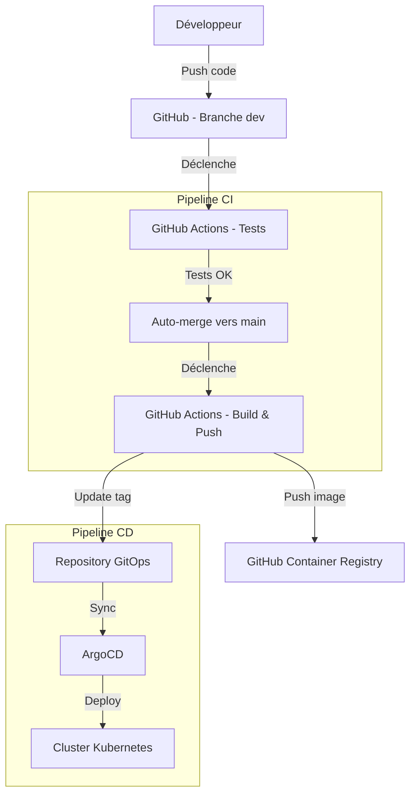

# Pipeline CI/CD Python - Projet Complet

Un pipeline CI/CD complet pour applications Python utilisant GitHub Actions, ArgoCD et Kubernetes. Ce projet démontre les pratiques DevOps modernes incluant les tests automatisés, la containerisation, le déploiement GitOps et l'infrastructure as code.

## Vue d'Ensemble du Projet

Ce projet implémente un pipeline CI/CD complet avec les composants suivants :

- **Application Python Flask** : API REST simple avec endpoints de santé et de calcul
- **GitHub Actions** : Workflows automatisés de test, build et déploiement
- **Docker** : Application containerisée avec builds multi-stage
- **Kubernetes** : Orchestration de containers avec Helm charts
- **ArgoCD** : Déploiement continu basé sur GitOps
- **Tests Complets** : Tests unitaires, d'intégration et validation de déploiement

## Architecture du Pipeline



## Structure du Projet

```
├── app/                           # Application Python Flask
│   ├── main.py                   # Point d'entrée de l'application
│   └── api/                      # Modules API
│       ├── health.py             # Endpoint de santé
│       ├── hello.py              # Endpoint de bienvenue
│       ├── calculator.py         # Endpoint de calcul
│       └── metrics.py            # Endpoint de métriques Prometheus
├── tests/                         # Tests unitaires et d'intégration
│   ├── test_health.py            # Tests endpoint santé
│   ├── test_hello.py             # Tests endpoint hello
│   └── test_calculator.py        # Tests endpoint calcul
├── .github/workflows/             # Workflows GitHub Actions
│   ├── test-and-merge.yml        # Tests et merge automatique
│   └── build-and-deploy.yml      # Build et déploiement
├── argocd/                        # Configuration ArgoCD
│   ├── application.yaml          # Application ArgoCD
│   ├── project.yaml              # Projet ArgoCD
│   ├── setup-argocd.sh          # Script d'installation
│   └── README.md                 # Documentation ArgoCD
├── gitops-example/                # Exemple de repository GitOps
│   └── helm-chart/               # Charts Helm
│       ├── Chart.yaml            # Métadonnées du chart
│       ├── values.yaml           # Valeurs par défaut
│       └── templates/            # Templates Kubernetes
├── docs/                          # Documentation complète
│   ├── github-actions-setup.md   # Configuration GitHub Actions
│   ├── github-secrets-setup.md   # Configuration des secrets
│   └── security-implementation.md # Implémentation sécurité
├── Dockerfile                     # Configuration container
├── requirements.txt               # Dépendances Python
├── pyproject.toml                # Configuration projet Python
└── README.md                     # Ce fichier
```

## Fonctionnalités Principales

### 🚀 Pipeline CI/CD Automatisé
- **Tests automatiques** sur push vers `dev`
- **Merge automatique** vers `main` si tests réussis
- **Build et push** d'images Docker vers GHCR
- **Déploiement automatique** via ArgoCD

### 🔒 Sécurité Intégrée
- **Scan de vulnérabilités** avec Trivy
- **Utilisateur non-root** dans les containers
- **Gestion sécurisée des secrets** GitHub
- **Permissions minimales** pour GitHub Actions
- **Analyse statique** du code Python

### 📊 Monitoring et Observabilité
- **Health checks** personnalisés
- **Métriques Prometheus** intégrées (/metrics)
- **ServiceMonitor** pour scraping automatique
- **Métriques système** (CPU, mémoire, disque)
- **Logs structurés** en JSON
- **Alertes** sur échecs de déploiement

### 🛠️ Configuration Kubernetes
- **Helm charts** paramétrables
- **Multi-environnements** (dev, staging, prod)
- **Auto-scaling** horizontal (HPA)
- **Network policies** pour la sécurité
- **Resource limits** et requests

## Prérequis

### Outils Requis
- **Docker** et Docker Compose
- **kubectl** configuré pour votre cluster
- **Helm** 3.x
- **Git** et GitHub CLI (optionnel)
- **Python** 3.11+ pour le développement local

### Infrastructure
- **Cluster Kubernetes** (minikube, kind, ou cloud provider)
- **ArgoCD** installé sur le cluster
- **GitHub Container Registry** activé
- **Repository GitOps** séparé

### Permissions GitHub
- **Actions** : Exécution des workflows
- **Packages** : Push vers GitHub Container Registry
- **Contents** : Lecture/écriture du code
- **Security Events** : Upload des rapports de sécurité

## Installation Rapide

### 1. Cloner le Repository
```bash
git clone https://github.com/menraromial/python-cicd-pipeline.git
cd python-cicd-pipeline
```

### 2. Configuration des Secrets GitHub
```bash
# Créer un Personal Access Token avec permissions repo et workflow
# Ajouter GITOPS_TOKEN dans les secrets du repository
```

### 3. Créer le Repository GitOps
```bash
# Créer un nouveau repository : python-cicd-pipeline-gitops
# Copier le contenu de gitops-example/ vers le nouveau repository
```

### 4. Installer ArgoCD
```bash
cd argocd
./setup-argocd.sh
```

### 5. Tester l'Application Localement
```bash
# Installer les dépendances
pip install -r requirements.txt

# Lancer les tests
pytest tests/ -v --cov=app

# Construire et tester l'image Docker
docker build -t python-cicd-app .
docker run -p 5000:5000 python-cicd-app

# Tester les endpoints
curl http://localhost:5000/health
curl http://localhost:5000/api/hello
curl -X POST http://localhost:5000/api/calculate \
  -H "Content-Type: application/json" \
  -d '{"operation": "add", "a": 5, "b": 3}'
```

## Utilisation

### Développement Local
1. Créer une branche feature : `git checkout -b feature/nouvelle-fonctionnalite`
2. Développer et tester localement
3. Pousser vers la branche `dev` : `git push origin dev`
4. Les tests s'exécutent automatiquement
5. Si les tests passent, merge automatique vers `main`
6. Build et déploiement automatiques

### Déploiement en Production
1. Le push vers `main` déclenche le build
2. L'image Docker est construite et poussée vers GHCR
3. Le repository GitOps est mis à jour automatiquement
4. ArgoCD détecte le changement et déploie
5. Validation automatique du déploiement

### Monitoring et Debugging
```bash
# Vérifier le statut de l'application ArgoCD
kubectl get application python-cicd-app -n argocd

# Voir les logs de l'application
kubectl logs -l app=python-cicd-app -f

# Accéder à l'interface ArgoCD
kubectl port-forward svc/argocd-server -n argocd 8080:443
# Ouvrir https://localhost:8080
```

## Configuration ArgoCD

Le dossier `argocd/` contient une configuration complète d'ArgoCD pour le déploiement GitOps :

### Fichiers de Configuration
- **`application.yaml`** : Application ArgoCD avec sync automatique et self-healing
- **`project.yaml`** : Projet ArgoCD pour la sécurité et l'organisation
- **`argocd-config.yaml`** : Configuration serveur avec health checks personnalisés
- **`webhook-config.yaml`** : Configuration webhook pour détection rapide des changements

### Scripts de Gestion
- **`setup-argocd.sh`** : Installation et configuration automatisées d'ArgoCD
- **`validate-config.sh`** : Validation et test de la configuration
- **`test-deployment.sh`** : Suite de tests complète du déploiement

### Fonctionnalités Clés
- **Sync Automatique** : Détecte les changements dans le repository GitOps et déploie automatiquement
- **Self-Healing** : Annule les changements manuels pour maintenir l'état désiré
- **Health Checks Personnalisés** : Validation de santé spécifique à l'application
- **Sécurité RBAC** : Contrôle d'accès basé sur les rôles pour différents groupes d'utilisateurs
- **Multi-Environnements** : Support pour les déploiements staging et production

## Documentation Détaillée

### 📋 Guides de Configuration
- **[Guide de Mise en Place](docs/setup-guide.md)** : Guide étape par étape pour installer et configurer le pipeline complet
- **[Configuration GitHub Actions](docs/github-actions-setup.md)** : Guide complet de configuration des workflows
- **[Configuration des Secrets](docs/github-secrets-setup.md)** : Gestion sécurisée des secrets GitHub

### 🏗️ Architecture et Structure
- **[Structure du Projet](docs/project-structure.md)** : Description détaillée de tous les fichiers et dossiers
- **[Diagramme du Pipeline](docs/pipeline-diagram.md)** : Diagrammes visuels du flux CI/CD complet

### 🔒 Sécurité et Déploiement
- **[Implémentation Sécurité](docs/security-implementation.md)** : Mesures de sécurité DevSecOps complètes
- **[Configuration ArgoCD](argocd/README.md)** : Guide détaillé ArgoCD et GitOps
- **[Repository GitOps](gitops-example/README.md)** : Configuration du repository GitOps

## Exemples de Commandes

### Tests et Qualité du Code
```bash
# Exécuter tous les tests avec couverture
pytest tests/ -v --cov=app --cov-report=html

# Linting du code
flake8 app/ tests/
black app/ tests/ --check

# Analyse de sécurité
bandit -r app/ -f json -o bandit-report.json
safety check --json --output safety-report.json
```

### Docker et Containerisation
```bash
# Build multi-platform
docker buildx build --platform linux/amd64,linux/arm64 -t python-cicd-app .

# Scan de sécurité de l'image
docker run --rm -v /var/run/docker.sock:/var/run/docker.sock \
  aquasec/trivy image python-cicd-app

# Test du container
docker run -d -p 5000:5000 --name test-app python-cicd-app
docker exec test-app curl http://localhost:5000/health
docker stop test-app && docker rm test-app
```

### Kubernetes et Helm
```bash
# Installer le chart Helm localement
helm install python-cicd-app gitops-example/helm-chart/ \
  --set image.tag=latest \
  --set replicaCount=2

# Mettre à jour le déploiement
helm upgrade python-cicd-app gitops-example/helm-chart/ \
  --set image.tag=main-abc123

# Tester les endpoints déployés
kubectl port-forward svc/python-cicd-app 8080:80
curl http://localhost:8080/health
```

### ArgoCD et GitOps
```bash
# Synchroniser manuellement l'application
argocd app sync python-cicd-app

# Voir l'historique des déploiements
argocd app history python-cicd-app

# Rollback vers une version précédente
argocd app rollback python-cicd-app 5
```

## Dépannage

### Problèmes Courants

**1. Échec des Tests GitHub Actions**
- Vérifier les logs dans l'onglet Actions
- Valider la syntaxe des tests localement
- Contrôler les dépendances dans requirements.txt

**2. Échec du Build Docker**
- Tester le Dockerfile localement
- Vérifier que tous les fichiers nécessaires sont inclus
- Contrôler les permissions et l'utilisateur non-root

**3. Problèmes de Synchronisation ArgoCD**
- Vérifier l'accès au repository GitOps
- Contrôler la validité des manifestes Kubernetes
- Examiner les logs d'ArgoCD

**4. Erreurs de Déploiement Kubernetes**
- Vérifier les ressources disponibles dans le cluster
- Contrôler les limites et requests de ressources
- Examiner les logs des pods

### Logs et Debugging
```bash
# Logs GitHub Actions
# Disponibles dans l'interface GitHub sous l'onglet Actions

# Logs ArgoCD
kubectl logs -n argocd deployment/argocd-server
kubectl logs -n argocd deployment/argocd-application-controller

# Logs de l'application
kubectl logs -l app=python-cicd-app -f --tail=100

# Événements Kubernetes
kubectl get events --sort-by=.metadata.creationTimestamp
```

## Contribution

### Workflow de Contribution
1. Fork le repository
2. Créer une branche feature : `git checkout -b feature/amelioration`
3. Développer et tester les changements
4. Pousser vers votre fork : `git push origin feature/amelioration`
5. Créer une Pull Request vers la branche `dev`

### Standards de Code
- **Tests** : Couverture minimale de 80%
- **Linting** : Code conforme à flake8 et black
- **Sécurité** : Pas de vulnérabilités critiques ou hautes
- **Documentation** : Documenter les nouvelles fonctionnalités

## Licence

Ce projet est sous licence MIT. Voir le fichier [LICENSE](LICENSE) pour plus de détails.

## Support et Contact

- **Issues** : Utiliser les GitHub Issues pour les bugs et demandes de fonctionnalités
- **Discussions** : Utiliser les GitHub Discussions pour les questions générales
- **Documentation** : Consulter le dossier `docs/` pour la documentation détaillée

## 🚀 Optimisations de Production

Ce projet inclut des optimisations complètes pour la production :

### Configuration des Ressources
- **Autoscaling intelligent** : HPA avec comportements personnalisés
- **Limites optimisées** : CPU/mémoire/stockage éphémère configurés
- **Distribution des pods** : Topology spread constraints pour la haute disponibilité

### Monitoring Intégré
- **Métriques Prometheus** : Endpoint `/metrics` avec métriques système et applicatives
- **ServiceMonitor** : Configuration automatique pour Prometheus
- **Health checks** : Liveness et readiness probes optimisés

### Sécurité Renforcée
- **Image Docker optimisée** : Multi-stage, utilisateur non-root, scan de vulnérabilités
- **Contexte de sécurité** : ReadOnlyRootFilesystem, capabilities dropped
- **Network policies** : Isolation réseau par environnement

### Environnements Multiples
- **Development** : Configuration minimale pour développement local
- **Staging** : Configuration intermédiaire avec monitoring
- **Production** : Configuration complète avec sécurité renforcée

### Validation Automatique
```bash
# Exécuter la validation complète de production
python scripts/validate_production_config.py
```

Pour plus de détails, consultez le [Guide d'Optimisation Production](docs/production-optimization.md).

## Roadmap

### Version 1.1 (Prochaine)
- [x] Support multi-environnements (staging/prod)
- [x] Intégration monitoring avec Prometheus/Grafana
- [ ] Tests de charge automatisés
- [ ] Notifications Slack/Teams

### Version 1.2 (Future)
- [ ] Support bases de données (PostgreSQL)
- [ ] Cache Redis intégré
- [ ] API versioning
- [ ] Documentation OpenAPI/Swagger

---

**Note** : Ce projet est conçu à des fins éducatives et de démonstration. Pour un usage en production, adaptez les configurations de sécurité et de performance selon vos besoins spécifiques.
