# Diagramme du Pipeline CI/CD

Ce document présente les diagrammes détaillés du pipeline CI/CD, illustrant les flux de données, les interactions entre composants et les processus automatisés.

## Vue d'Ensemble du Pipeline

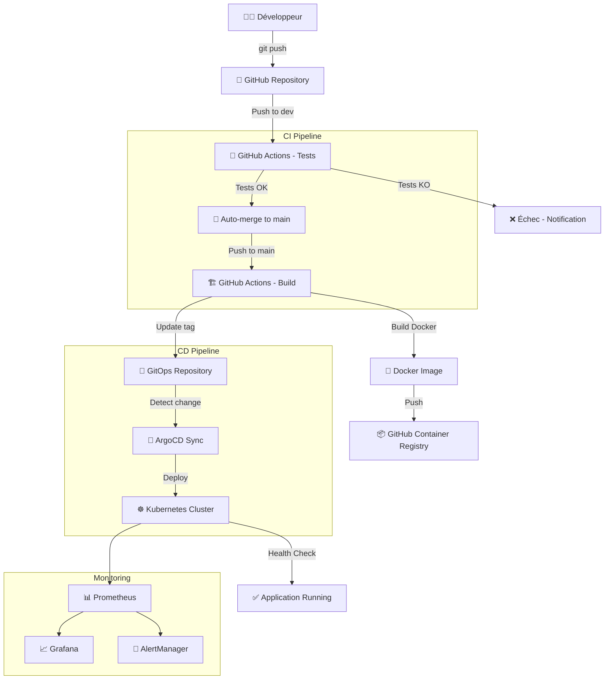

## Flux Détaillé du Pipeline CI

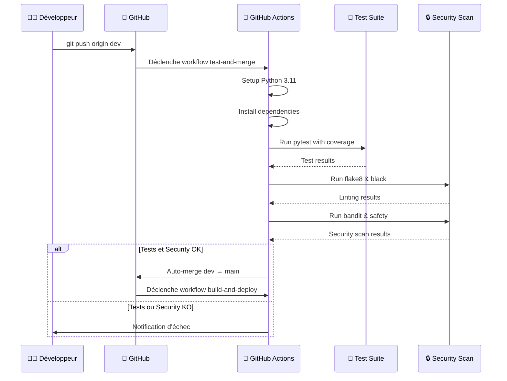

## Flux Détaillé du Pipeline CD

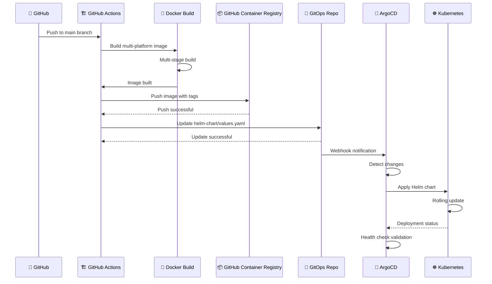

## Architecture des Composants

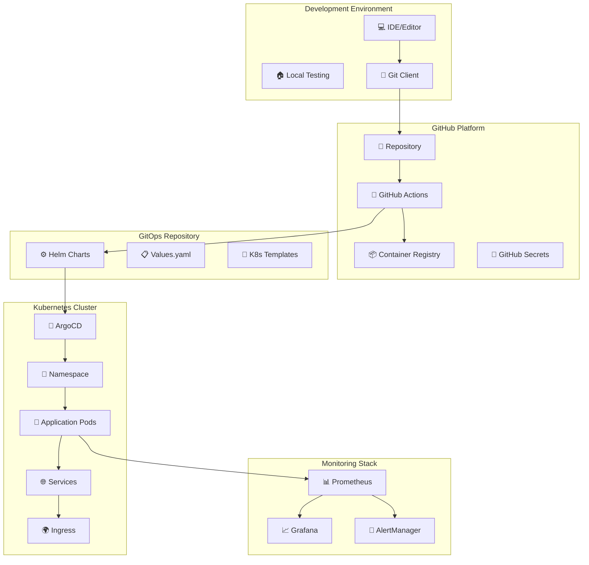

## Flux de Sécurité

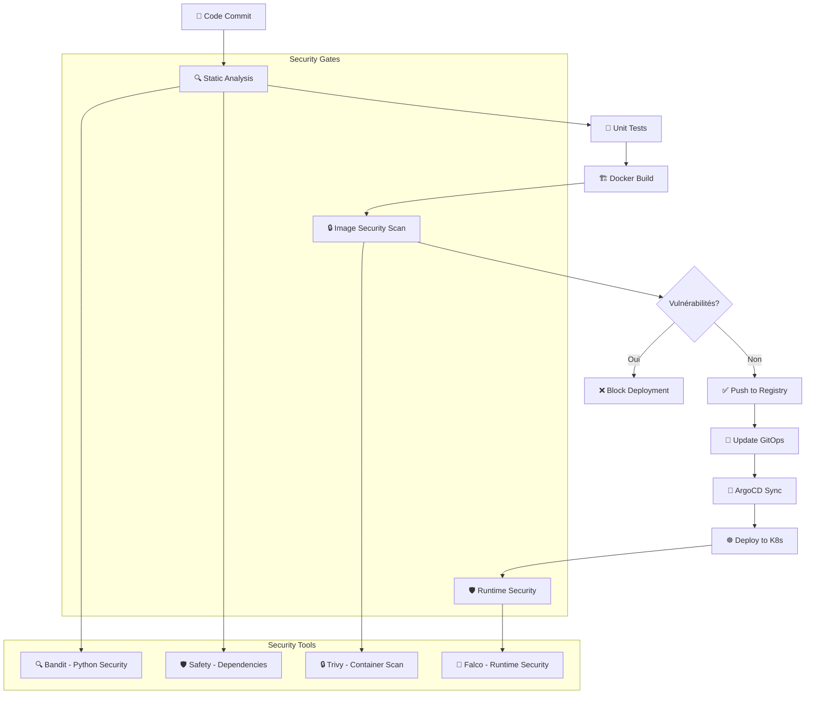

## Workflow GitHub Actions Détaillé

### Test and Merge Workflow

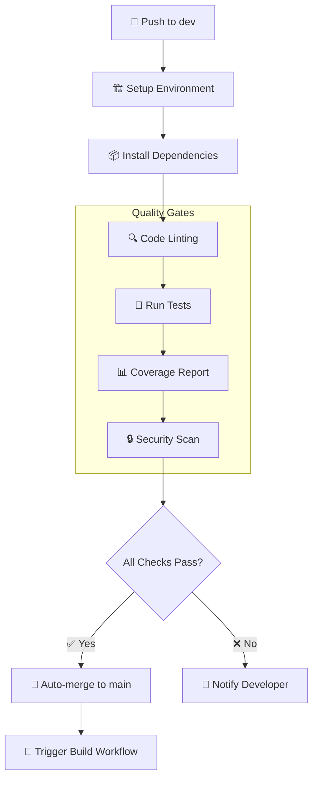

### Build and Deploy Workflow

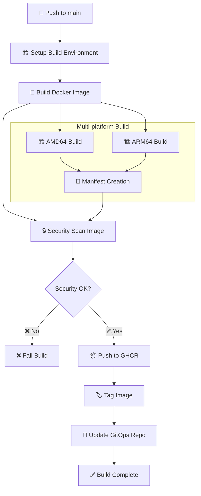

## ArgoCD Sync Process

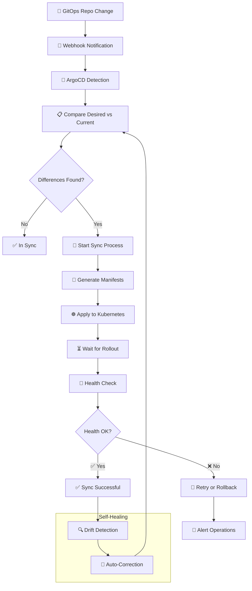

## Déploiement Kubernetes

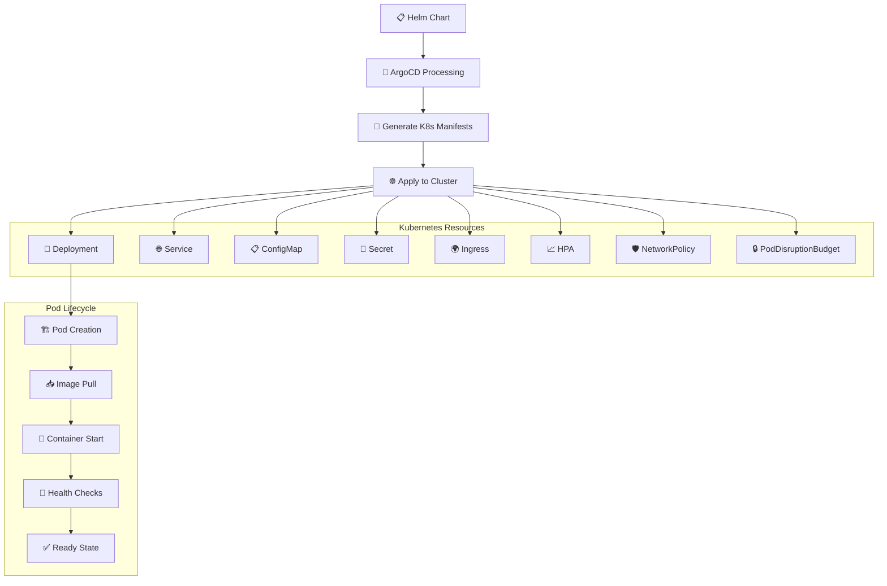

## Monitoring et Observabilité

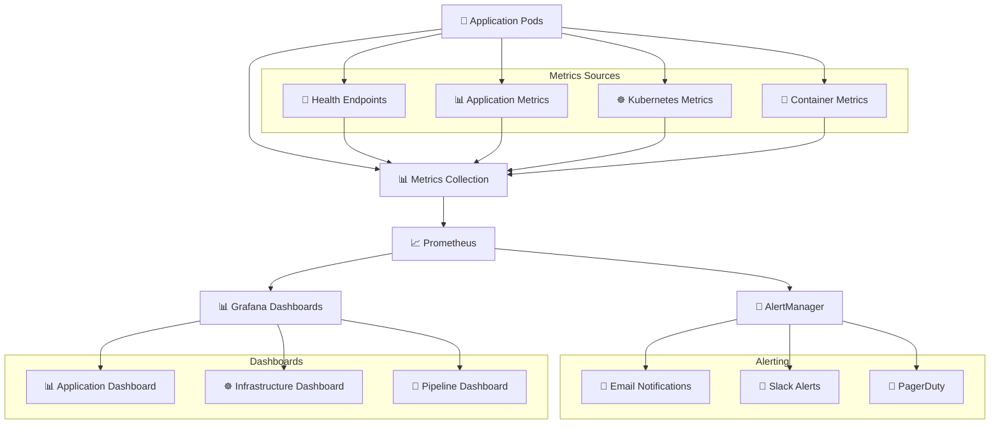

## Gestion des Erreurs et Rollback

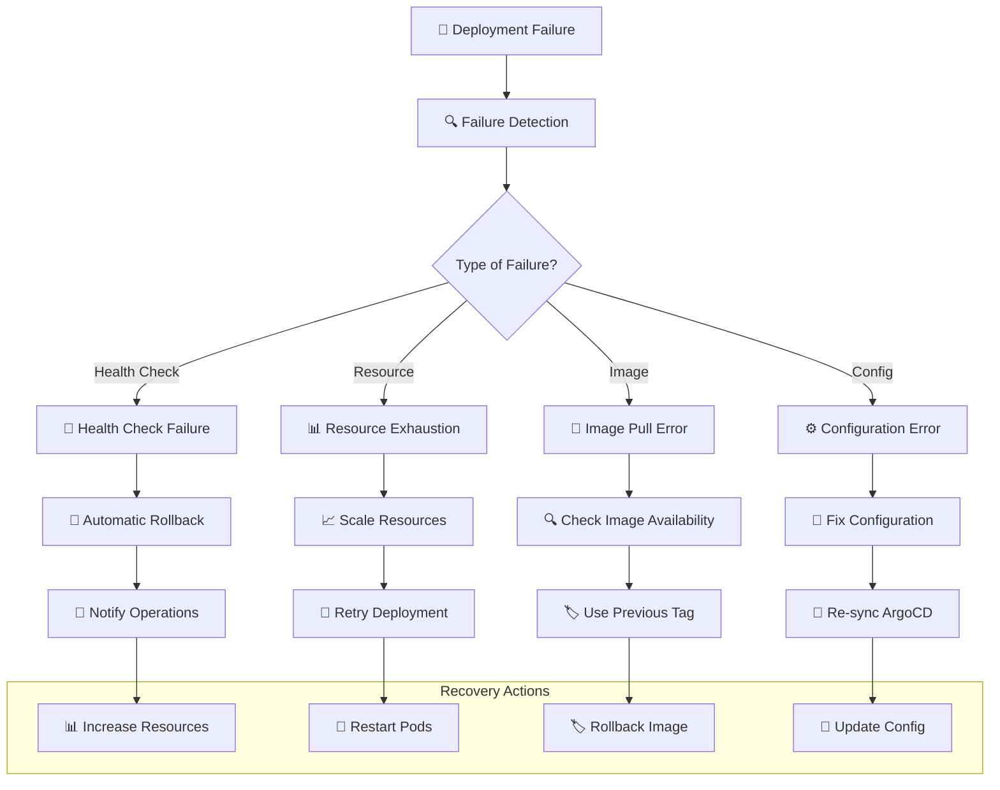

## Flux de Données

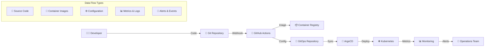

## Environnements et Promotion

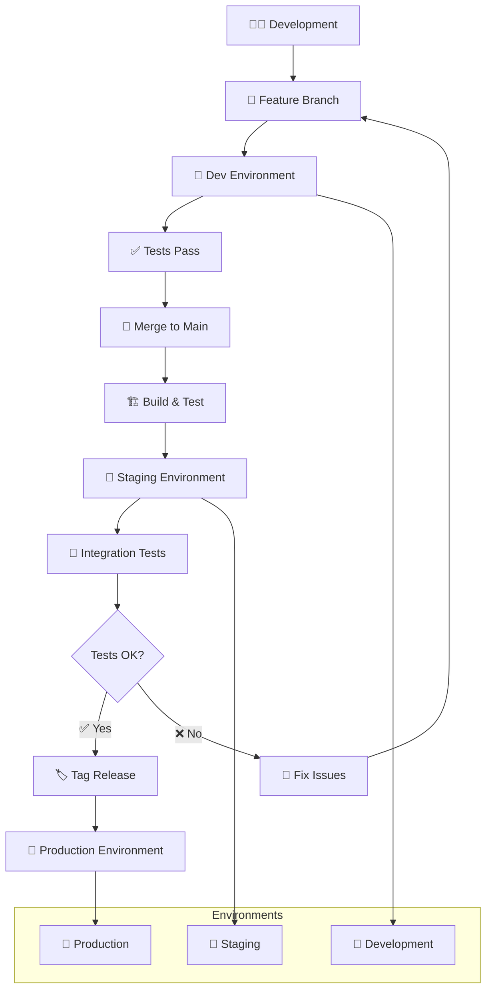

Ces diagrammes illustrent la complexité et l'automatisation du pipeline CI/CD, montrant comment chaque composant interagit pour fournir un déploiement sûr, automatisé et observable des applications Python.