# Diagramme du Pipeline CI/CD

Ce document présente les diagrammes détaillés du pipeline CI/CD, illustrant les flux de données, les interactions entre composants et les processus automatisés.

## Vue d'Ensemble du Pipeline

```mermaid
graph TD
    A[👨‍💻 Développeur] -->|git push| B[📂 GitHub Repository]
    B -->|Push to dev| C[🔄 GitHub Actions - Tests]
    C -->|Tests OK| D[🔀 Auto-merge to main]
    C -->|Tests KO| E[❌ Échec - Notification]
    D -->|Push to main| F[🏗️ GitHub Actions - Build]
    F -->|Build Docker| G[🐳 Docker Image]
    G -->|Push| H[📦 GitHub Container Registry]
    F -->|Update tag| I[📝 GitOps Repository]
    I -->|Detect change| J[🔄 ArgoCD Sync]
    J -->|Deploy| K[☸️ Kubernetes Cluster]
    K -->|Health Check| L[✅ Application Running]
    
    subgraph "CI Pipeline"
        C
        D
        F
    end
    
    subgraph "CD Pipeline"
        I
        J
        K
    end
    
    subgraph "Monitoring"
        M[📊 Prometheus]
        N[📈 Grafana]
        O[🚨 AlertManager]
    end
    
    K --> M
    M --> N
    M --> O
```

## Flux Détaillé du Pipeline CI

```mermaid
sequenceDiagram
    participant Dev as 👨‍💻 Développeur
    participant GitHub as 📂 GitHub
    participant Actions as 🔄 GitHub Actions
    participant Tests as 🧪 Test Suite
    participant Security as 🔒 Security Scan
    
    Dev->>GitHub: git push origin dev
    GitHub->>Actions: Déclenche workflow test-and-merge
    Actions->>Actions: Setup Python 3.11
    Actions->>Actions: Install dependencies
    Actions->>Tests: Run pytest with coverage
    Tests-->>Actions: Test results
    Actions->>Security: Run flake8 & black
    Security-->>Actions: Linting results
    Actions->>Security: Run bandit & safety
    Security-->>Actions: Security scan results
    
    alt Tests et Security OK
        Actions->>GitHub: Auto-merge dev → main
        GitHub->>Actions: Déclenche workflow build-and-deploy
    else Tests ou Security KO
        Actions->>Dev: Notification d'échec
    end
```

## Flux Détaillé du Pipeline CD

```mermaid
sequenceDiagram
    participant GitHub as 📂 GitHub
    participant Actions as 🏗️ GitHub Actions
    participant Docker as 🐳 Docker Build
    participant GHCR as 📦 GitHub Container Registry
    participant GitOps as 📝 GitOps Repo
    participant ArgoCD as 🔄 ArgoCD
    participant K8s as ☸️ Kubernetes
    
    GitHub->>Actions: Push to main branch
    Actions->>Docker: Build multi-platform image
    Docker->>Docker: Multi-stage build
    Docker->>Actions: Image built
    Actions->>GHCR: Push image with tags
    GHCR-->>Actions: Push successful
    Actions->>GitOps: Update helm-chart/values.yaml
    GitOps-->>Actions: Update successful
    
    GitOps->>ArgoCD: Webhook notification
    ArgoCD->>ArgoCD: Detect changes
    ArgoCD->>K8s: Apply Helm chart
    K8s->>K8s: Rolling update
    K8s-->>ArgoCD: Deployment status
    ArgoCD->>ArgoCD: Health check validation
```

## Architecture des Composants

```mermaid
graph TB
    subgraph "Development Environment"
        IDE[💻 IDE/Editor]
        Local[🏠 Local Testing]
        Git[📝 Git Client]
    end
    
    subgraph "GitHub Platform"
        Repo[📂 Repository]
        Actions[🔄 GitHub Actions]
        GHCR[📦 Container Registry]
        Secrets[🔐 GitHub Secrets]
    end
    
    subgraph "GitOps Repository"
        HelmChart[⚙️ Helm Charts]
        Values[📋 Values.yaml]
        Templates[📄 K8s Templates]
    end
    
    subgraph "Kubernetes Cluster"
        ArgoCD[🔄 ArgoCD]
        Namespace[📁 Namespace]
        Pods[🏃 Application Pods]
        Services[🌐 Services]
        Ingress[🌍 Ingress]
    end
    
    subgraph "Monitoring Stack"
        Prometheus[📊 Prometheus]
        Grafana[📈 Grafana]
        AlertManager[🚨 AlertManager]
    end
    
    IDE --> Git
    Git --> Repo
    Repo --> Actions
    Actions --> GHCR
    Actions --> HelmChart
    HelmChart --> ArgoCD
    ArgoCD --> Namespace
    Namespace --> Pods
    Pods --> Services
    Services --> Ingress
    Pods --> Prometheus
    Prometheus --> Grafana
    Prometheus --> AlertManager
```

## Flux de Sécurité

```mermaid
graph TD
    A[📝 Code Commit] --> B[🔍 Static Analysis]
    B --> C[🧪 Unit Tests]
    C --> D[🏗️ Docker Build]
    D --> E[🔒 Image Security Scan]
    E --> F{Vulnérabilités?}
    F -->|Oui| G[❌ Block Deployment]
    F -->|Non| H[✅ Push to Registry]
    H --> I[📝 Update GitOps]
    I --> J[🔄 ArgoCD Sync]
    J --> K[☸️ Deploy to K8s]
    K --> L[🛡️ Runtime Security]
    
    subgraph "Security Gates"
        B
        E
        L
    end
    
    subgraph "Security Tools"
        M[🔍 Bandit - Python Security]
        N[🛡️ Safety - Dependencies]
        O[🔒 Trivy - Container Scan]
        P[🚨 Falco - Runtime Security]
    end
    
    B --> M
    B --> N
    E --> O
    L --> P
```

## Workflow GitHub Actions Détaillé

### Test and Merge Workflow

```mermaid
graph TD
    A[🔄 Push to dev] --> B[🏗️ Setup Environment]
    B --> C[📦 Install Dependencies]
    C --> D[🔍 Code Linting]
    D --> E[🧪 Run Tests]
    E --> F[📊 Coverage Report]
    F --> G[🔒 Security Scan]
    G --> H{All Checks Pass?}
    H -->|✅ Yes| I[🔀 Auto-merge to main]
    H -->|❌ No| J[📧 Notify Developer]
    I --> K[🏁 Trigger Build Workflow]
    
    subgraph "Quality Gates"
        D
        E
        F
        G
    end
```

### Build and Deploy Workflow

```mermaid
graph TD
    A[🔄 Push to main] --> B[🏗️ Setup Build Environment]
    B --> C[🐳 Build Docker Image]
    C --> D[🔒 Security Scan Image]
    D --> E{Security OK?}
    E -->|❌ No| F[❌ Fail Build]
    E -->|✅ Yes| G[📦 Push to GHCR]
    G --> H[🏷️ Tag Image]
    H --> I[📝 Update GitOps Repo]
    I --> J[✅ Build Complete]
    
    subgraph "Multi-platform Build"
        C1[🏗️ AMD64 Build]
        C2[🏗️ ARM64 Build]
        C3[🔗 Manifest Creation]
    end
    
    C --> C1
    C --> C2
    C1 --> C3
    C2 --> C3
    C3 --> D
```

## ArgoCD Sync Process

```mermaid
graph TD
    A[📝 GitOps Repo Change] --> B[🔔 Webhook Notification]
    B --> C[🔄 ArgoCD Detection]
    C --> D[📋 Compare Desired vs Current]
    D --> E{Differences Found?}
    E -->|No| F[✅ In Sync]
    E -->|Yes| G[🔄 Start Sync Process]
    G --> H[📄 Generate Manifests]
    H --> I[☸️ Apply to Kubernetes]
    I --> J[⏳ Wait for Rollout]
    J --> K[🏥 Health Check]
    K --> L{Health OK?}
    L -->|✅ Yes| M[✅ Sync Successful]
    L -->|❌ No| N[🔄 Retry or Rollback]
    N --> O[📧 Alert Operations]
    
    subgraph "Self-Healing"
        P[🔍 Drift Detection]
        Q[🔄 Auto-Correction]
    end
    
    M --> P
    P --> Q
    Q --> D
```

## Déploiement Kubernetes

```mermaid
graph TD
    A[📋 Helm Chart] --> B[🔄 ArgoCD Processing]
    B --> C[📄 Generate K8s Manifests]
    C --> D[☸️ Apply to Cluster]
    
    subgraph "Kubernetes Resources"
        E[🚀 Deployment]
        F[🌐 Service]
        G[📋 ConfigMap]
        H[🔐 Secret]
        I[🌍 Ingress]
        J[📈 HPA]
        K[🛡️ NetworkPolicy]
        L[🔒 PodDisruptionBudget]
    end
    
    D --> E
    D --> F
    D --> G
    D --> H
    D --> I
    D --> J
    D --> K
    D --> L
    
    subgraph "Pod Lifecycle"
        M[🏗️ Pod Creation]
        N[📥 Image Pull]
        O[🏃 Container Start]
        P[🏥 Health Checks]
        Q[✅ Ready State]
    end
    
    E --> M
    M --> N
    N --> O
    O --> P
    P --> Q
```

## Monitoring et Observabilité

```mermaid
graph TD
    A[🏃 Application Pods] --> B[📊 Metrics Collection]
    B --> C[📈 Prometheus]
    C --> D[📊 Grafana Dashboards]
    C --> E[🚨 AlertManager]
    
    subgraph "Metrics Sources"
        F[🏥 Health Endpoints]
        G[📊 Application Metrics]
        H[☸️ Kubernetes Metrics]
        I[🐳 Container Metrics]
    end
    
    A --> F
    A --> G
    A --> H
    A --> I
    
    F --> B
    G --> B
    H --> B
    I --> B
    
    subgraph "Alerting"
        J[📧 Email Notifications]
        K[💬 Slack Alerts]
        L[📱 PagerDuty]
    end
    
    E --> J
    E --> K
    E --> L
    
    subgraph "Dashboards"
        M[📊 Application Dashboard]
        N[☸️ Infrastructure Dashboard]
        O[🔄 Pipeline Dashboard]
    end
    
    D --> M
    D --> N
    D --> O
```

## Gestion des Erreurs et Rollback

```mermaid
graph TD
    A[🚨 Deployment Failure] --> B[🔍 Failure Detection]
    B --> C{Type of Failure?}
    
    C -->|Health Check| D[🏥 Health Check Failure]
    C -->|Resource| E[📊 Resource Exhaustion]
    C -->|Image| F[🐳 Image Pull Error]
    C -->|Config| G[⚙️ Configuration Error]
    
    D --> H[🔄 Automatic Rollback]
    E --> I[📈 Scale Resources]
    F --> J[🔍 Check Image Availability]
    G --> K[📝 Fix Configuration]
    
    H --> L[📧 Notify Operations]
    I --> M[🔄 Retry Deployment]
    J --> N[🏷️ Use Previous Tag]
    K --> O[🔄 Re-sync ArgoCD]
    
    subgraph "Recovery Actions"
        P[📊 Increase Resources]
        Q[🔄 Restart Pods]
        R[🏷️ Rollback Image]
        S[📝 Update Config]
    end
    
    L --> P
    M --> Q
    N --> R
    O --> S
```

## Flux de Données

```mermaid
graph LR
    A[👨‍💻 Developer] -->|Code| B[📂 Git Repository]
    B -->|Webhook| C[🔄 GitHub Actions]
    C -->|Image| D[📦 Container Registry]
    C -->|Config| E[📝 GitOps Repository]
    E -->|Sync| F[🔄 ArgoCD]
    F -->|Deploy| G[☸️ Kubernetes]
    G -->|Metrics| H[📊 Monitoring]
    H -->|Alerts| I[🚨 Operations Team]
    
    subgraph "Data Flow Types"
        J[📝 Source Code]
        K[🐳 Container Images]
        L[⚙️ Configuration]
        M[📊 Metrics & Logs]
        N[🚨 Alerts & Events]
    end
```

## Environnements et Promotion

```mermaid
graph TD
    A[👨‍💻 Development] --> B[🧪 Feature Branch]
    B --> C[🔄 Dev Environment]
    C --> D[✅ Tests Pass]
    D --> E[🔀 Merge to Main]
    E --> F[🏗️ Build & Test]
    F --> G[🚀 Staging Environment]
    G --> H[🧪 Integration Tests]
    H --> I{Tests OK?}
    I -->|✅ Yes| J[🏷️ Tag Release]
    I -->|❌ No| K[🔄 Fix Issues]
    J --> L[🌟 Production Environment]
    K --> B
    
    subgraph "Environments"
        M[🔧 Development]
        N[🧪 Staging]
        O[🌟 Production]
    end
    
    C --> M
    G --> N
    L --> O
```

Ces diagrammes illustrent la complexité et l'automatisation du pipeline CI/CD, montrant comment chaque composant interagit pour fournir un déploiement sûr, automatisé et observable des applications Python.